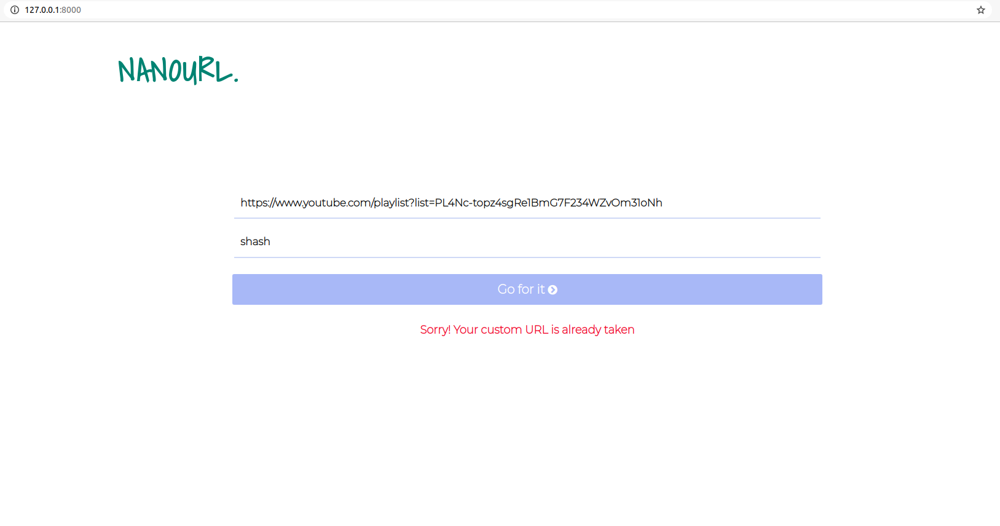
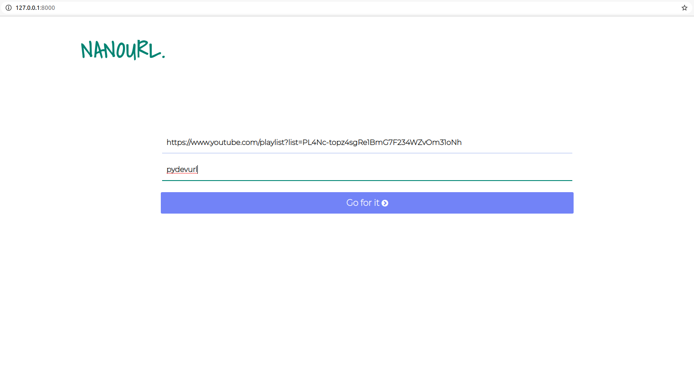
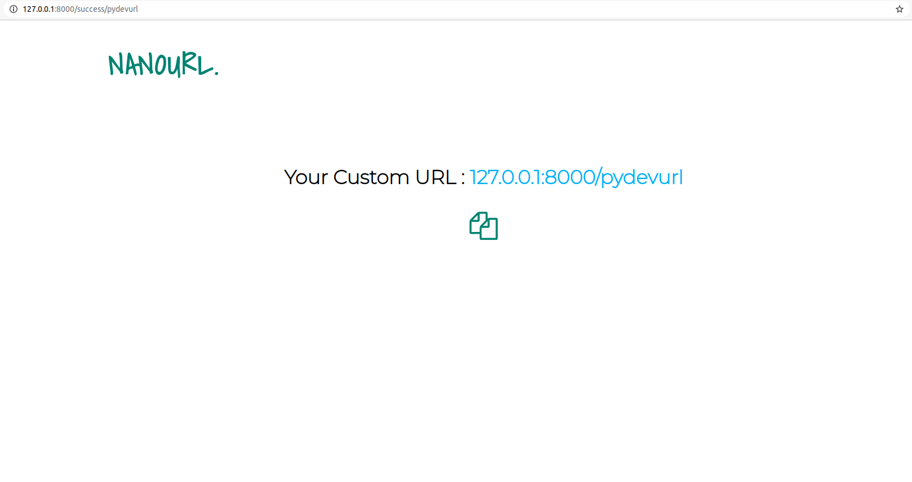

## NANOURL - A URL Shortener Django App

> It's a URL Shortener app created using Python's most popular web framework Django.

### Feature

- Paste a very long URL and type a custom short URL
- Even if your LONG URL misses https, www, etc. It'll handle all cases
- There is real time AJAX validation for already existing and invalid URLs

### How to RUN

**This procedure is useful for MAC/LINUX. I'm not sure about Windows.**

**Step 1:**
Frst Install python3 and pip3 in Your system. You can find many tutorials and blog online. (Ignore if already installed)

**Step 2:**
Install Virtial Environment "virtualenv" so that your local Python Dependencies are untouched when installing this Project's dependencies.

```bash
$ pip3 install virtualenv
```

**Step 4:**

Clone this GITHUB REPO using this Link : https://github.com/shash68i/URL-SHORTENER.git in your desired Directory.

```bash
$ git clone https://github.com/shash68i/URL-SHORTENER.git
```

**Step 5:**
Now you'll be having Project Folder "URL_SHORTENER". Navigate to that folder.

```bash
$ cd URL-SHORTENER
```

**Step 6:**
Create a Virtual Environment here. You can name anything, but in my case I'm using '_venv_'

```bash
$ virtualenv venv
```

**Step 7:**
Activate the Virtual Environment

```bash
$ source venv/bin/activate
```

Replace the name 'venv' with the name of your virtual environment name, if it's different.

**Step 6:**
Install Dependencies

```bash
$ pip3 install -r requirements.txt
```

**Step 6:**
Now make databases migrations

```bash
$ python3 manage.py makemigrations
$ python3 manage.py migrate
```

**Step 6:**
Everything's Done!
Now just run the server

```bash
$ python3 manage.py runserver
```

Wohoo! It's done.
Now go to you browser's search box and paste the server IP **127.0.0.1:8000**

### Example:

**When custom URL already exists**


**When URL is unique**


**After it's done, you get a succes page. Just click on the copy button and paste it in Browser.**


&copy; shashank 2020
